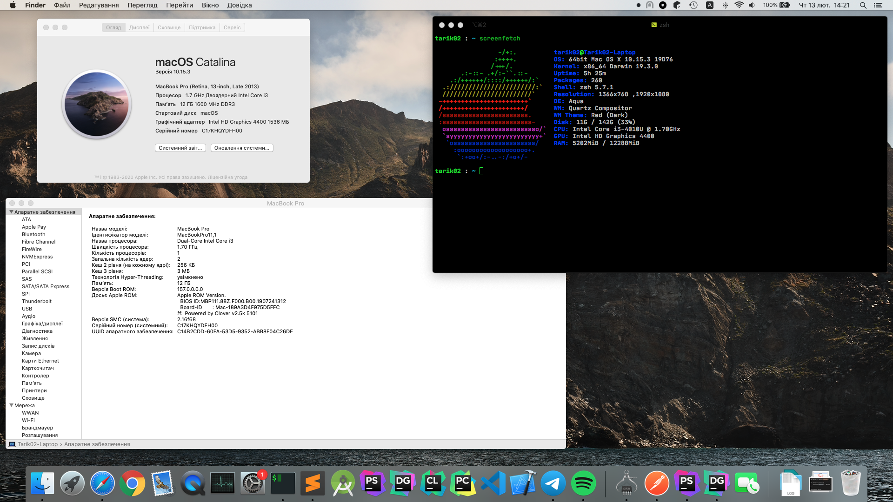

# Hackintosh-IdeaPad-S510P

#### macOS 10.15.x



## Working/Not working

- [x] Audio & Headphones
- [x] Native power management
- [x] iGPU (dGPU disabled)
- [ ] Optimus dGPU (Nvidia 720m)
- [x] Battery info
- [x] Brightness and other hotkeys (screenshot, media, etc.)
- [ ] Ethernet (not sure)
- [x] Camera (internal USB)
- [x] Card Reader (internal USB)
- [ ] Sleep + Wake (some strange problems with this, some issue with graphics)
- [x] Sleep/Wake by lid
- [x] TouchPad (custom VoodooPS2)
- [x] WiFi (original works slowly, replaced with BCM94352 + BIOS patch)
- [ ] Bluetooth (original works only after reboot from supported OS, firmware issue)

What about sleep/wake issue: laptop can't go sleep is it did not sleep some time longer than 2 hours (also, can't shutdown/reboot in such case). Also, if you put laptop to sleep and try to reboot after that, it reboots, but internal displays stays black until you put it to sleep and wake. That all seems to be some issue with graphics, but idk how to fix that.

### Installation

Default

#### Post Installation

- Disable Hibernation

```sh
$ sudo pmset -a hibernatemode 0
$ sudo rm /var/vm/sleepimage
$ sudo mkdir /var/vm/sleepimage
$ sudo pmset -a standby 0
$ sudo pmset -a autopoweroff 0
```

## Credits

- **Special Thanks** to [Acidanthera](https://github.com/acidanthera) for most of the Kexts.
- **Special Thanks** to [RehabMan](https://github.com/RehabMan).
- Thanks to [Clover Bootloader](https://sourceforge.net/projects/cloverefiboot).
- Thanks to [al3xtjames](https://github.com/al3xtjames) for [NoTouchID](https://github.com/al3xtjames/NoTouchID).

